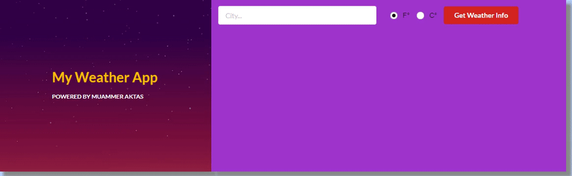

# Weather App with React
Created weather app with React by retrieving weather data from OpenWeatherMap API with fetch function. 

Here is the preview of my app like below.

## Todo
1. Add Location Detection system
2. Allow users to save their favorite locations
3. UI Enhancements and Validations
4. Use Google Maps to show selected city on the map

[Let's Connect]("https://www.linkedin.com/in/muammeraktas/")